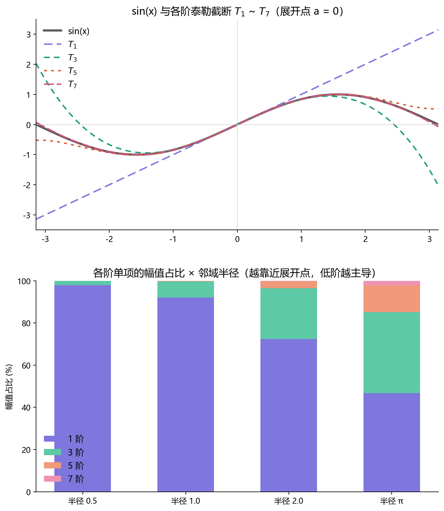
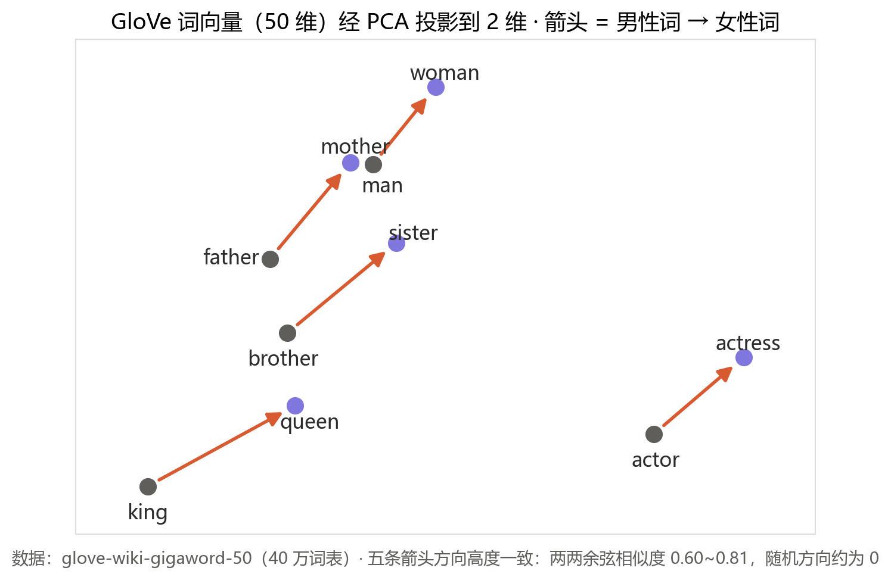

# 第一章：元数据（Metadata）

在正式展开"结构"的讨论之前，我们先从一类特殊的信息说起——**元数据**：关于信息的信息。

## 递归与无限

有那么一些特殊的结构，它们通过自解释、自展开，织出一条无限循环的信息链。经典的例子是 GNU = "GNU's Not Unix"，以及 YAML = "YAML Ain't Markup Language"——它们在形式上就是一个无限递归的定义：看起来像定义，实际上又拒绝被彻底定义。

下面这个构造出来的句子更进一步。它既是一个陈述句，描述了一个简单的事实；又恰恰因为它描述的是自己，完成了信息上的自我递归：

> 我正在描述我这句话的元数据——它有23个字符。

（含标点；破折号"——"占两个字符。不妨数一数。）

从这些例子里，我们能触到元数据的前两个特殊性质：**无限性**与**递归性**。

这种递归除了体现在句子自身，还体现在对信息的逐层归纳与总结上。下面这座塔从第一行出发，每一行都是对上一行的统计描述：

> 这是一个用来体现归纳和总结的例子
>
> 这个句子有16个字符
>
> 它的元数据有10个字符
>
> 它的元元数据有11个字符
>
> 它的元元元数据有12个字符

这座塔可以无限地垒上去——对元数据本身，永远还可以再做一次统计。

需要说明的是，元数据并不专指数据的长度。任何对信息——即包含有意义内容的任意载体——的统计与描述，都可以充当元数据。它甚至可能被信息本身所陈述：就像前面那个自我递归的句子，一段信息既是信息本身，也是自己的元数据。

## 信息退化

元数据具有一定程度的**信息退化**特性。

最经典的表现是求导。导数本质上是函数的一种元数据：一阶导数和二阶导数往往有清晰的数学与物理意义——速度、加速度、曲线的凹凸；但到了三阶、四阶，概念的意义迅速模糊，它们在描述函数时所占的分量也越来越轻。

另一个更具代表性的例子是泰勒展开。在一个点的附近，泰勒展开能够无限逼近原函数，而低阶项贡献了绝大部分的拟合度——离展开点越近，这种主导越绝对；随着距离拉远，高阶项的作用才逐渐显现。

上图是一个可复现的数值实验（sin x 在 0 点展开）：邻域半径为 0.5 时，一阶项独占 97.9% 的幅值；半径放大到 π，占比才降到 46.7%。低阶项是函数的"骨架"，高阶项只是在修饰边角。

这些例子共同指向同一件事：**在一层层的推导中，元数据会逐渐丧失信息的复杂性——变得平滑，同时损失掉一部分信息。**

## 泛性

元数据的最后一个、也是最重要的特点，是**泛性**，或者说通用性：对于内容上完全不同的信息，我们通常能找到某个元数据，把它们放到同一把尺子下衡量、联系起来。

**时间戳。** 一张照片、一笔转账、一次地震、一条聊天记录——内容上毫无共性，但都有"发生于何时"。正因如此，手机相册才能把照片、视频、地点拼成"那一天"的回忆；侦探才能把通话记录、监控画面、消费小票对齐到同一条时间线上还原案件。时间是几乎不需要解释的泛性元数据。

**价格。** 一次理发、一斤苹果、一小时劳动、一份软件授权——异质到无法直接比较的东西，全部被"价格"这一个维度通约了。货币本质上就是人类发明的一种泛性元数据：它不描述任何商品的内容，却能衡量和联系所有商品。

**向量嵌入。** 今天的 AI 把一张猫的照片、"猫"这个汉字、一声猫叫，全部映射成同一个空间里的向量——内容完全异质的信息，从此有了可计算的"距离"。CLIP 能用文字搜图片、用图片搜文字，靠的就是这个共同坐标系。可以说，embedding 是人类历史上第一次为"语义"本身建立的泛性元数据——而这恰恰是大模型智能的根基之一。

在向量嵌入这个领域，有一个家喻户晓的经典等式：

> king − man + woman ≈ queen

而且这并不是精心挑选的孤例。在 40 万词的 GloVe 向量空间里做同样的加减法，五组性质完全不同的关系全部命中：

| 运算 | 第一名（余弦相似度） | 捕捉到的关系 |
| --- | --- | --- |
| king − man + woman | **queen** (0.852) | 性别 |
| paris − france + japan | **tokyo** (0.923) | 首都 |
| walked − walk + swim | **swam** (0.799) | 时态 |
| bigger − big + cold | **warmer** (0.748) | 比较级 |
| einstein − physics + painting | **picasso** (0.805) | 领域大师 |

最后一组尤其妙："物理学之于爱因斯坦，等于绘画之于毕加索"——这种类比连人都要想一下，而它就藏在向量减法里。

上图中：把五对"男性词 → 女性词"的向量画出来，五条箭头的方向高度一致。没有任何人把"性别"编程进向量空间，它是从海量文本的统计规律中**自己浮现出来的语义方向**——泛性元数据不仅把异质的信息放上了同一把尺子，还让尺子上原本看不见的结构显形了。

## 小结

无限性与递归性、信息退化、泛性——这三组性质让元数据成为一种独特的存在：它从信息中来，却比信息更轻、更通用，也更模糊。在后面的章节里，当我们尝试用"结构"去丈量世界时，元数据将是反复出现的脚手架。
