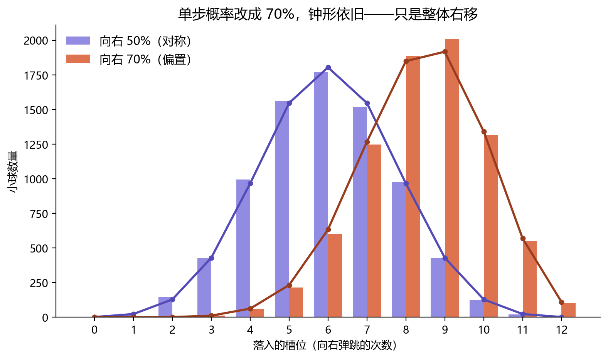

# 第三章：概率——统计事件涌现出的元数据

## 从硬币到钟形

投掷一枚硬币，它有 50% 的概率正面朝上。再投一次，这个概率并不会改变。但如果我们统计"连续两次"的结果，画面就变了：两次都是正面的概率是 25%，一正一反是 50%，两次都是反面又是 25%。

抽象的数学概念很容易让我们迷失在数字的海洋里。我们不妨换一个更生动具体的工具——**高尔顿钉板**。

我们把硬币视作小球：抛出正面，等价于碰到钉子后向左弹；抛出反面，则向右弹。那么"连续抛两次硬币"，就相当于一块两层的钉板——50% 的小球落入中间的槽位，剩下的 25% 落入左侧（连续两次正面），25% 落入右侧（连续两次反面）。

把层数加到十几排之后，小球最终落进底部的某个槽里。单看一颗球，它的路径完全是随机的，我们无法预测它会落在哪儿；可一旦放下成千上万颗球，底部堆叠出来的形状，却稳定得近乎确定——一条钟形曲线。

上图是一次模拟的结果：12 排钉子、8000 颗小球。每一颗的去向都由一连串独立的、纯粹随机的左右弹跳决定，但累积起来的落点分布，几乎完美地贴合理论上的二项分布 B(12, 0.5)。样本均值落在 5.98（理论值为 6），中间那个槽位接住了约 22% 的球；而"一路同向弹到底"的两个极端槽位，合计只分到了 0.05%。

没有任何一颗球"想要"组成钟形曲线，也没有谁在中途调度它们。形状不是被规定的，而是从大量随机事件中**涌现**出来的。

## 不止于对称

这条曲线我们称之为正态分布。有趣的是，它并不仅限于这种 50% 对 50% 的对称模型——就算把单步概率改成向左 30%、向右 70%，大量小球累积后仍会呈现类似的钟形，只是整条曲线整体右移、略微偏斜。

上图把两块钉板叠在一起：对称的那条峰值落在槽位 6，偏置到 70% 的那条峰值右移到了槽位 9（样本均值 8.41，理论值正是 12 × 0.7 = 8.4）。单步的偏向只是挪动了钟形的位置，却没有改变"涌现出一座钟"这件事本身。

## 中心极限定理

3Blue1Brown（3B1B）有一支视频[《But what is the Central Limit Theorem?》](https://www.youtube.com/watch?v=zeJD6dqJ5lo)把这件事讲得更细，这里不再赘述。它的核心思想之一是：**把大量独立的随机变量求和（或取平均），不论每一个单独看是什么形态、多么简单或复杂，只要叠加得足够多，最终的总和都会趋近于正态分布。** 钉板里小球的落点，正是十几次"向左或向右"的随机弹跳累加的结果——所以一座钟会从中浮现，并非巧合。

这似乎揭示了一个蕴含在定理之中的哲学思考：**复杂的形态，可以源自简单概率的大量重复；单个概率本身长什么样甚至并不重要，重要的只有"重复"这个过程本身。**

## 正态分布也是一种元数据

这个定理还和我们在第一章谈到的"元数据在高阶上的平滑"遥相呼应。

要描述一个分布的形状，我们其实是在层层叠加地使用它的"描述量"：一阶的**均值**决定它的位置（钟峰在哪里），二阶的**方差**决定它的胖瘦（钟形是宽是窄），再往上，三阶的**偏度**衡量它歪不歪，四阶的**峰度**衡量它尖不尖……这些越来越高阶的量，描述的是越来越精细的形状细节。

而正态分布有一个独一无二的性质：**它三阶及以上的描述量全部为零。** 偏度是零，峰度是零，再高阶的也都是零——它把所有精细的形状信息都抹平了，只留下"位置"和"胖瘦"这两个最粗的数字。

中心极限定理做的，正是这场"抹平"：不管原始分布原本有多么歪、多么尖，求和叠加得越多，那些高阶的描述量就衰减得越接近零，最后只剩下均值和方差。这恰恰是第一章里"信息退化"的严格翻版——当时是函数的三阶、四阶导数逐渐失去意义、权重降低；这里是分布的三阶、四阶描述量直接归零。

所以正态分布本身，就是一种被极度压缩过的元数据：它是无数复杂分布在反复叠加后、把高阶信息磨光之后，**共同剩下的那个壳**。

## 通向智能

我们在这一章里反复看到同一件事：底层是纯粹的随机与简单，宏观却涌现出稳定的结构；而这结构，是把海量细节平滑、压缩之后剩下的元数据。

这并不是一个只属于硬币和钉板的故事。接下来要谈的智能，同样不是被一行行设计出来的——它也是简单的规则，在足够大的规模上重复之后，自己长出来的形状。当我们说一个模型"学会"了什么，背后并没有谁写下那条规则；就像没有哪一颗小球被告知要去组成一座钟。

带着"涌现"与"元数据"这两件工具，我们正式走向本书的主角之一——智能。
