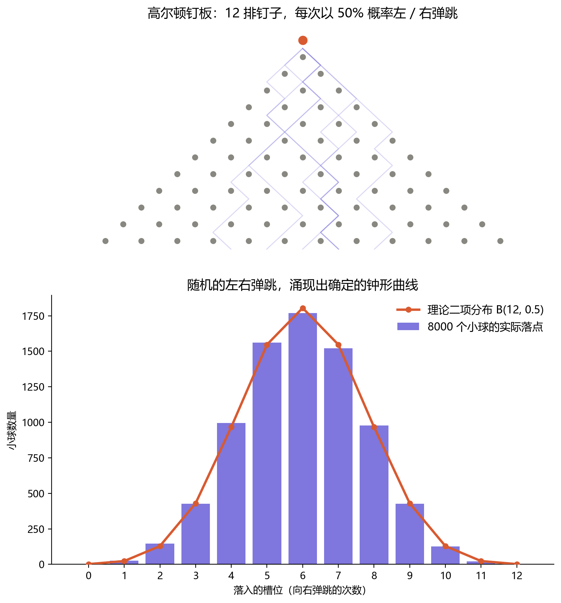

# 第三章：概率——统计事件涌现出的元数据

投掷一枚硬币，它有 50% 的概率正面朝上。再投一次，这个概率并不会改变。但如果我们统计"连续两次"的结果，画面就变了：两次都是正面的概率是 25%，一正一反是 50%，两次都是反面又是 25%。

抽象的数学概念很容易让我们迷失在数字的海洋里。我们不妨换一个更生动具体的工具——**高尔顿钉板**。

一颗小球从顶端落下，每碰到一排钉子，就以一半对一半的概率向左或向右弹一下。十几排钉子之后，它落进底部的某个槽里。单看一颗球，它的路径完全是随机的，我们无法预测它会落在哪儿；可一旦放下成千上万颗球，底部堆叠出来的形状，却稳定得近乎确定——一条钟形曲线。

上图是一次真实的模拟：12 排钉子、8000 颗小球。每一颗的去向都由一连串独立的、纯粹随机的左右弹跳决定，但累积起来的落点分布，几乎完美地贴合理论上的二项分布 B(12, 0.5)。样本均值落在 5.98（理论值为 6），中间那个槽位接住了约 22% 的球；而"一路同向弹到底"的两个极端槽位，合计只分到了 0.05%。

没有任何一颗球"想要"组成钟形曲线，也没有谁在中途调度它们。形状不是被规定的，而是从大量随机事件中**涌现**出来的。

<!-- 待续：从这里展开"概率作为一种涌现出的元数据"的论证 -->
