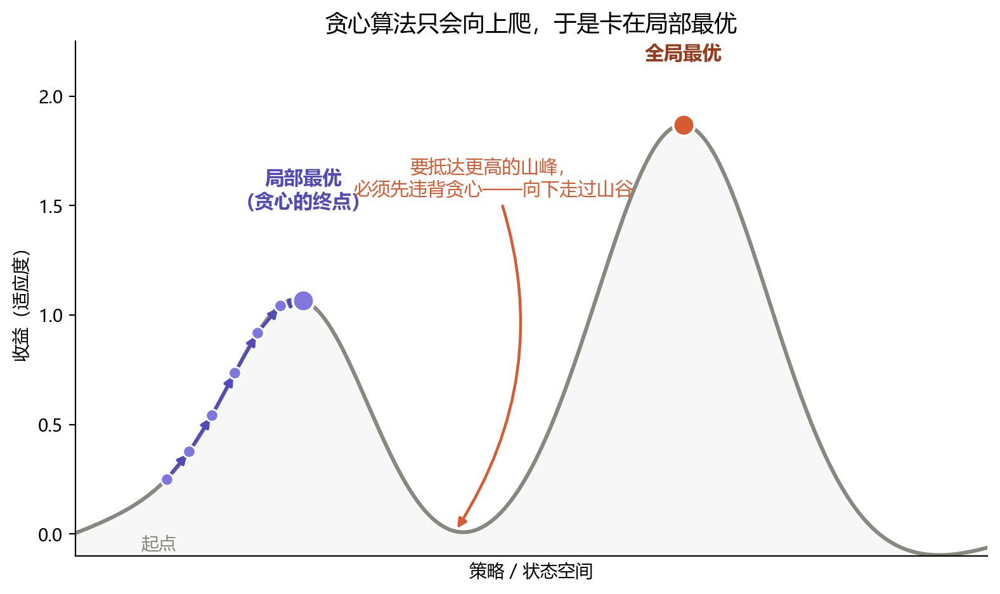

# 第四章：智能（Intelligence）

## 用"元数据归纳"重新定义智能

在我们真正谈论起人工智能（AI）之前，我更希望先谈论"智能"（Intelligence）这个定义本身。第二章里我们粗浅地用"延续"来描述生命的特征，然而那种描述只归纳了生命的一部分终局目的；在它之下，个体所拥有的智能，会被压缩成一个微不足道的属性——这很容易被看作忽略了生命的主观能动性。

这里我不打算用"主观能动性"这样含糊的概念去描述生物的智能，而是希望换一个更便于分析、更容易被体系化处理的概念，来量化这种能力：

**元数据归纳的能力。**

这恰好接续了上一章的线索。第三章里我们看到，复杂的结构能从简单规则的大量重复中涌现；而智能，正是生命对这种涌现的"反向工程"——它不去记录世界的全部细节，而是从纷繁的信息里抽取出若干关键的元数据，用它们来把握、应对整个世界。

## 草履虫与贪心算法

草履虫能应对复杂的环境变化，并不是因为它的基因里刻着一台记录了所有可能情况的状态机，而是基于某些特定的条件——膜电位、Ca²⁺ 浓度、K⁺ 通道状态、纤毛节律、能量水平、环境离子浓度……来触发特定的行为逻辑。这些条件当然不足以描述环境的全局，这也正是我们觉得草履虫的智能显得笨拙的原因；但它往往能走向一个**局部最优解**：遇到捕食者就远离，遇到食物就靠近，朝着更适合自己生存的渗透压梯度前进……

程序设计中有一个经典而简单的算法，叫作**贪心算法**，它的名字就生动地道出了本质——贪婪而短视：有利益就前进，没利益就避让。这种做法的内核，正是把复杂环境的某些元数据提取出来，当作判断的指标和行动的准绳。这个过程我们有许多叫法——抽象、归纳、总结、观察……但它们的本质都是对信息的再加工：把信息的某种特性抽离出来，借助元数据的泛用性进行统一的判断。

贪心的代价，是它只能看见脚下。如果把"收益"想象成一片高低起伏的地形，那么一个只会向上爬的策略，终将停在离它最近的那座山头——哪怕远处还有更高的山峰。

这座爬不出去的山头，就是**局部最优**。草履虫的智能正卡在这里：它能爬上眼前的小坡（远离捕食者、靠近食物），却没有能力意识到，越过一道山谷之外还有更优的解。而要抵达那座更高的山峰，必须先**违背贪心**——主动向下，穿过低谷。接下来要看的，正是生命如何一步步挣脱这种短视。

## 从个体到群体

更复杂一些的生物，尤其是具备一定社会性的生物，比如土拨鼠，则能做出更"远视"的行为——站岗放哨。对于放哨的个体而言，这是一件负收益或低收益的事：它要持续付出成本，自己却得不到多少好处（相比那些正在休息的同伴）。但当土拨鼠们轮流这样做时，种群整体的存活率反而提高了。

这里发生的，其实不只是"走出局部最优"。放哨的个体并没有把**自己的**收益优化得更好——它优化的是另一个量：种群（也就是基因）的存活。换句话说，改变的不是搜索策略，而是**目标函数本身**：从"个体的即时收益"换成了"基因的延续"。而"基因的延续"，正是第二章那把尺子的核心——个体可以牺牲，被延续下去的结构却因此活得更久。

另一个更有意思的例子是蚂蚁。单个蚂蚁的行为逻辑极其简单——搜索、上报、搬运、喂养……它的神经系统也极其简陋。但当大量蚂蚁聚成一个种群之后，它们的社会性复杂度会远远超出单个个体的行为逻辑：蚁群会抱团成一只巨大的球来抵御洪水，会用身体主动搭出一座"桥"以跨过沟壑。这些行为并不来自任何一只蚂蚁的能力，而是简单的智能在**数量与结构**的推动下，涌现出的另一种智能——这正是上一章所说的涌现，只不过这一次，从中长出来的不是钟形曲线，而是智能本身。

## 人类，与智能的边界

目前已知最复杂的生命体——人类——则是这两条路径的集大成者。作为个体，人类拥有已知最复杂的行为模式，从思想、人格到记忆，每一环的差异都会极大地塑造一个人的最终形态；而从群体来看，数十亿人编织成一张庞大的社会网络，连由此形成的组织，都会获得超越个体的、自我延续的动力。这种复杂度，几乎注定无法用某条"规律"去穷尽——正如第二章里我们用无限细分的尺规去划定生命定义时遭遇的失败，想用尺规去划清智能的边界，恐怕同样是一场与无穷的纷争。

因此，我们索性退一步，用"元数据归纳的能力"作为一把基础的尺子，去大致评估那些经典的智能形式，以及一些非经典的智能形式（比如蚂蚁的社会）——这样反而可能有意外的收获。

在这个视角下，**智能就是对信息的加工**。从近乎零加工的膝跳反射，到极尽复杂的人格组成，智能处理的始终是来自客观世界的信息。受限于主观体验的复杂与难以量化，我们暂时还无法把它完整地纳入这个框架；但只要谈的是纯理性的部分——生存、繁衍、延续——这个视角就是一件精妙的工具，帮我们看清什么是智能。

## 下一个问题：意识

可是，还有一个问题被我们绕过去了：那个正在"加工信息"的主体，那个被我们称为"自己"的东西，又是什么？

如果组成"我"的原子在岁月里被一颗颗替换干净，那个"我"还在吗？智能可以被定义为一种能力，但**意识**——那个体验着这一切的视角——究竟栖身于何处？下一章，我们将借助一艘古老的船——**特修斯之船**——去追问一个更根本的问题：意识，是一种什么样的存在？
